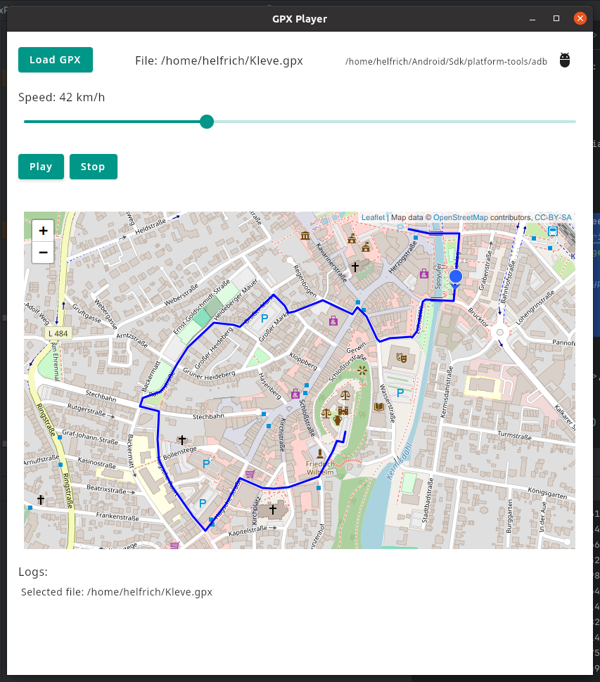

# GpxPlayerDesktop

GpxPlayerDesktop is a modern desktop application built with Kotlin and Jetpack Compose for Desktop. It allows playback of `.gpx` track files with live location simulation, ideal for Android development and GPS testing.



## Features

- 📍 GPX file loading and map visualization
- 🛰️ Simulated playback with speed control
- 🎯 Location marker with heading orientation
- 🚗 Free-drive mode with keyboard steering and live speed/heading readouts
- 🧭 Optional map centering based on approximate IP geolocation when idle
- 📡 ADB integration to send mock locations to connected Android devices
- ☁️ Interface with [GpxPlayer for Android](https://github.com/Pygmalion69/GpxPlayerAndroid)
- 🌍 Interactive map (Leaflet.js) embedded via JavaFX WebView
- 💾 Persistent ADB path configuration
- 🖥️ Cross-platform support (Windows/Linux)

## Getting Started

### Prerequisites

- Java 17+
- Android device with developer options enabled
- `adb` (Android Debug Bridge) installed

### Running

```
./gradlew run
```

or build native distributions:

```
./gradlew packageDistributionForCurrentOS
```

### GPX Playback

1. Click **Load GPX** to select a `.gpx` file.
2. Adjust the playback speed using the slider.
3. Press **Play** to simulate the route on the map.
4. Use **Stop** to cancel simulation.

### Free Drive Mode

1. Click **Free drive** to enter free-drive mode (GPX playback will pause if active).
2. Pan the map to the desired start point and click **Set Position**.
3. Use the arrow keys to control the simulated vehicle:
   - **↑/↓** accelerate or decelerate.
   - **←/→** steer left or right.
4. Click **Clear position** to reset the free-drive session.

When no GPX track is loaded or vehicle position is set, the map automatically centers to an
approximate location based on IP geolocation (falling back to the default map center if
geolocation is unavailable).
